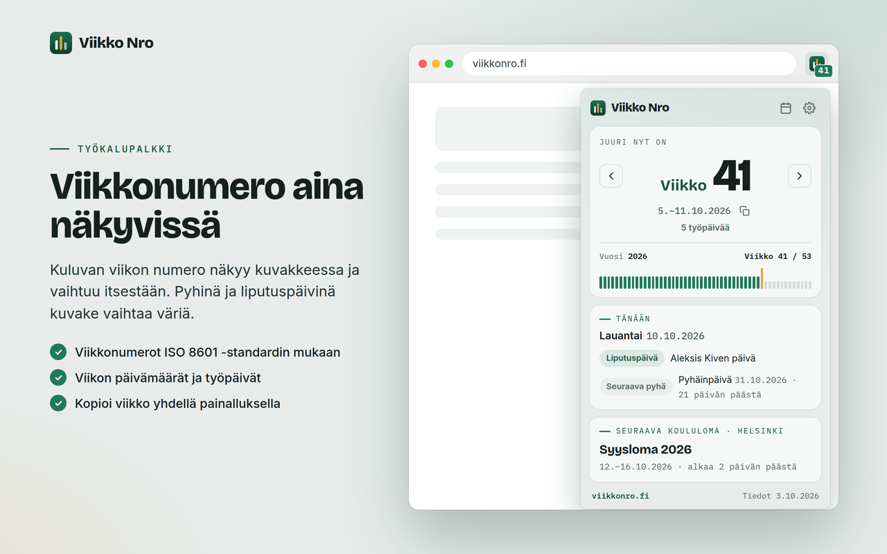

# Viikko Nro – browser extension

**Mikä viikko nyt on?** The current ISO 8601 week number in the browser toolbar, with the week's dates, Finnish flag days and school holidays. It is the browser extension of [viikkonro.fi](https://viikkonro.fi), built for Chrome, Edge and Firefox from a single codebase.



## Features

| | |
| --- | --- |
| **Toolbar badge** | The current ISO week (`42` or `vk42`), updated at local midnight. The tooltip shows the week's dates and working days, plus today's public holiday, flag day or school holiday. With "Highlight special days" on, the badge turns red on public holidays, blue on flag days and yellow during the chosen city's school holiday. |
| **Popup** | Week number and date range, step to other weeks, the year's week bars, the week's working days and public holidays, a copy button (`Viikko 42 (12.–18.10.2026)`), today's flag day or public holiday, a countdown to the next public holiday, your own countdown if set, an optional month calendar, and the next school holiday (hiihtoloma or syysloma) for the chosen city. Each block links to the matching page on viikkonro.fi. |
| **Public holidays** | Finnish pyhäpäivät computed for any year (Easter-based dates, Juhannus and Pyhäinpäivä Saturdays), plus Juhannusaatto and Jouluaatto, which count as days off. Working days are Monday–Friday minus these. |
| **Address bar** | Keyword `vk`: `vk 42`, `vk 42 2027`, `vk 2026-W42`, `vk 13.10.2026`, `vk 2026-10-13`, relative weeks `vk +3` / `vk -2`, ranges `vk 42-50` (weeks and working days), holiday names `vk juhannus`, `vk joulu 2027`, `vk pääsiäinen`, and date ranges `vk 1.3.–15.6.` (days and working days). A date shows its weekday and the days and working days until then (`vk 24.12.`). Enter opens the (first) week page. Short weeks show their working days. |
| **Keyboard shortcut** | `Alt+Shift+W` opens the popup (suggested key; the options page shows the key actually set, which the user can change in the browser's shortcut settings). |
| **Settings** | City (21 cities), badge format, special-day badge colours, copy format (`Viikko 42 (12.–18.10.2026)`, `2026-W42`, `vk 42` or the dates), your own countdown (a named date shown in the popup with days and working days to go), language (browser default, Finnish, English, Swedish), theme (match system, light, dark), reset. |
| **Privacy** | Permissions `storage` and `alarms` only. No host permissions, no network requests, no analytics. |

The UI uses the site's design system: its colour tokens, the Bricolage Grotesque, Inter and IBM Plex Mono fonts, the hero card and the week comb.

## Requirements

- Node.js 22 or newer (22.18+ for `pnpm store:assets`)
- pnpm 10 (`corepack enable`)
- For data syncs: a checkout of the viikkonro.fi site repo

## Getting started

```sh
pnpm install
pnpm dev              # opens Chrome with the extension and hot reload
pnpm dev:firefox      # same in Firefox
```

## Load the built extension by hand

**Chrome or Edge:** run `pnpm build`, open `chrome://extensions` (or `edge://extensions`), turn on **Developer mode**, click **Load unpacked**, and select:

```text
/Applications/Dixeam/viikkonro-extension/.output/chrome-mv3
```

> **"Manifest file is missing or unreadable"** means the project folder was selected. The source has no `manifest.json`; WXT generates it in `.output/chrome-mv3` during the build. `.output` is hidden on macOS, so press **Cmd+Shift+G** in the folder picker and paste the path above.

After changing the source, run `pnpm build` again and click **Reload** on the extension's card.

**Firefox:** run `pnpm build:firefox`, open `about:debugging#/runtime/this-firefox`, click **Load Temporary Add-on…**, and select `.output/firefox-mv3/manifest.json`.

## Commands

| Command | What it does |
| --- | --- |
| `pnpm dev` / `pnpm dev:firefox` | Development build with hot reload |
| `pnpm build` / `pnpm build:firefox` | Production build in `.output/chrome-mv3` / `.output/firefox-mv3` |
| `pnpm test` | Vitest: ISO week math for every day 2024–2035, address bar parsing, school and public holidays, working days, copy text, settings, message catalogs, store listing limits |
| `pnpm check` | Typecheck, lint, test, both builds, bundle size guard, `web-ext lint` |
| `pnpm zip` / `pnpm zip:firefox` | Store packages in `.output/`. The Firefox run also writes the sources zip AMO needs. |
| `pnpm data:sync` | Regenerate the bundled data from the site repo (see below) |
| `pnpm icons` | Regenerate all icons from the brand mark |
| `pnpm store:assets` | Regenerate the store promo tiles and screenshots from the real extension |

## Data

`src/data/generated/dataset.json` is generated from the site's own data modules. It is never edited by hand:

```sh
VIIKKONRO_SITE_DIR=~/Documents/Projects/weekdays pnpm data:sync
```

It covers the current and next calendar year, and the build fails if either is missing. Re-sync before every release and whenever the site's school holiday or flag day data changes.
- **School holidays:** city-level winter and autumn holidays with confidence tiers.
- **Name days:** stay out of the bundle until the site marks its name-day calendar complete, which waits on licensing.

## Icons and store graphics

| Output | Source | Command |
| --- | --- | --- |
| `public/icon/16.png`, `32.png` | Pixel-aligned redraws in `src/assets/icons/`, so the toolbar icon stays sharp | `pnpm icons` |
| `public/icon/48.png`, `96.png`, `128.png` | `src/assets/brand-mark.svg` (the site favicon). The 128 px icon has Chrome's required 16 px padding. | `pnpm icons` |
| `store/icon-128x128.png`, `store/edge-logo-300x300.png` | Same mark | `pnpm icons` |
| `store/<fi,en,sv>/promo-small-440x280.png`, `promo-marquee-1400x560.png` | Real extension captures on the site design | `pnpm store:assets` |
| `store/<fi,en,sv>/screenshot-1…5-*.png` (1280×800) | Same | `pnpm store:assets` |
| `store/listing/<fi,en>/summary.txt`, `description.txt` | SEO/GEO-optimized store copy | edited by hand |

## Publishing

- [docs/PUBLISHING.md](docs/PUBLISHING.md): step-by-step upload to the Chrome Web Store, Edge Add-ons and Firefox AMO, plus updates.
- [docs/store-listing.md](docs/store-listing.md): every form field, the graphics to use, the privacy answers, and the privacy policy text for viikkonro.fi.
- [REVIEWER_NOTES.md](REVIEWER_NOTES.md): build instructions for store reviewers.

## Project layout

```text
src/entrypoints/   background.ts (badge, alarms, omnibox), popup/, options/
src/components/    WeekHero, TodayBlock, HolidayBlock, icons
src/lib/           week math, i18n, formatting, UTM links, settings, badge, omnibox
src/data/          generated dataset, types, coverage check
src/styles/        tokens and components ported from the site's App.css
src/assets/        fonts, brand mark, pixel-aligned small icons
public/            _locales (fi default, en), generated icons
scripts/           data sync, icon and store graphic generation, size guard
store/             store graphics and listing copy
docs/              publishing guide and store listing
```

## Known data issue on the site

The site's flag day list (`weekdays/src/data/juhlapaivat.js`) should be checked against the Ministry of the Interior's official list before launch:
- It appears to leave out official flag days such as Itsenäisyyspäivä (6.12.), Vappu (1.5.), Kansallinen veteraanipäivä (27.4.) and Juhannuspäivä.
- `flagDayPages.js` calls 4 June "Suomen lipun päivä", but Suomen lipun päivä is Juhannuspäivä.

The extension shows whatever the site publishes, so fixing it there fixes both.
